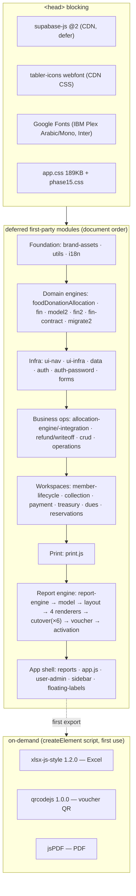

# SYS-001 — System Performance & Architecture Forensic Audit

> **Type:** read-only forensic engineering audit. **No** production code, accounting,
> DB, SQL, Supabase, business logic, rendering, reporting, or auth was modified.
> **No** optimization was implemented. Every metric is **measured** (see
> `SYS-001_METRICS_BASELINE.md`); every finding cites evidence. Recommendations live
> only in `SYS-001_PERFORMANCE_ROADMAP.md`.

## Executive summary

Diwan Finance is an intentionally **build-free, vanilla-JS SPA**: 47 first-party
modules (~870 KB) attach globals to a shared script scope and load at startup via
`<script defer>`, with `module.exports` present only for Node tests. Concepts like
bundling, tree-shaking, and code-splitting **do not apply** and are out of scope by
design.

The measured picture is that of a **healthy, well-structured application** with a
small number of concrete, evidence-backed scaling risks:

- **Startup is fast and stable** for the app shell: DOMContentLoaded ≈ **212 ms**
  (parse + eval of all 49 deferred scripts + login shell), first-paint ≈ **207 ms**.
- **The data path is already parallelized**: startup is a single `Promise.all` of ~13
  Supabase queries with explicit column projections and a capped `audit_log` — no
  N+1, no obvious duplicate startup requests.
- **Heavy libraries are deferred correctly**: `xlsx`, `qrcode`, and `jsPDF` load
  on-demand, not at startup.
- **The unified report engine renders cheaply at real-world sizes** (200-row statement
  ≈ 5 ms) but **degrades faster-than-linearly at extreme sizes** (2,000-row statement
  = 32 K DOM nodes, ~1 MB HTML, ~180 ms) because the statement table has **no
  virtualization/pagination** and is materialized as one `innerHTML` assignment.
- **The dominant structural risk is `app.js`** — 149 KB, ~62 `innerHTML` render sites
  — a "god module" that concentrates rendering, export, and orchestration.

None of these are correctness or accounting issues. They are scaling and
maintainability characteristics, documented here as the official baseline.

---

## 1 · Startup architecture & dependency graph

All 47 first-party modules load with `defer`, so they execute in **document order**
after HTML parse, then `DOMContentLoaded` fires. There is no first-party lazy loading
at the HTML level; "lazy" applies only to the three on-demand CDN libraries.

**Immediate startup cost** = HTML parse + eval of 49 scripts (~905 KB) + first paint
of the **login shell** (no data is fetched pre-auth). `loadAll` (the ~13-query
`Promise.all`) runs **after** successful authentication, so it is not on the
first-paint path. This ordering is a strength.

## 2 · JavaScript inventory analysis

- **47 modules, 869.6 KB.** Concentrated: the top 6 files (`app.js`, `i18n.js`,
  `crud.js`, `report-model.js`, `fin.js`, `operations.js`) are **47 %** of all JS.
- **`app.js` = 149.9 KB (17 % of all JS) with ~62 `innerHTML` render sites** — it owns
  state, most screen renders, exports, and orchestration. This is the single biggest
  structural concentration (see S2-1).
- **`i18n.js` = 69.9 KB** loaded fully at startup — the entire translation table is in
  the boot path (see S3-2).
- **Duplicated responsibility (benign):** `donationStmtLabel` (print.js) and its pure
  port `donationDesc` (report-model.js) intentionally co-exist as one rule expressed
  for two engines — documented in REPORT-001, not dead code.
- **Dormant-module heuristic:** no module is unreferenced. A few low-fan-in modules
  (`migrate2.js`, `refund-engine.js`, `writeoff-engine.js`) are referenced from a
  single site each and warrant a deeper reachability check (S3-3, medium confidence —
  reference-count heuristic, not a call-graph proof).
- **Circular dependencies:** not detectable as ES imports (there are none — globals on
  a shared scope). Runtime coupling exists (e.g. `reports.js` ↔ `app.js` call each
  other's globals) but is resolved lazily at call time, not at load; no load-order
  deadlock observed.

## 3 · Runtime & rendering (measured)

- The **unified report engine** render pipeline was measured end-to-end (see baseline
  §3). At Small/Medium sizes it is effectively free (≤ 5 ms). At the **Large** synthetic
  size (2,000 ledger rows) it produces **32,489 DOM nodes / 1.05 MB HTML / ~180 ms
  render** in a single `innerHTML` assignment.
- The dominant render mechanism across the app is **full `innerHTML` replacement**
  (app.js alone: ~62 sites). This is simple and leak-safe (see Strengths) but couples
  render cost directly to result-set size with no windowing.

## 4 · Memory & lifecycle (measured/static)

- **Interactivity is inline** (106 `onclick` + 12 `oninput/onchange` baked into the
  render strings). When a container's `innerHTML` is replaced, the old inline handlers
  are collected with the old nodes ⇒ **repeated re-renders do not accumulate
  listeners** — a genuine, structural anti-leak property.
- Engine screen surfaces additionally guard delegated listeners with an idempotent
  `__rptWired` flag (`report-cutover.js:88`, `report-cutover-core.js:65`).
- **One `setInterval`** (1 s clock, `ui-infra.js:107`), singular and intentional.
- **Residual to verify:** 60 element-level `addEventListener` sites — the engine ones
  are guarded; a targeted pass should confirm none of the remainder attach **inside a
  repeated-render path** without a guard (S3-1, medium confidence).

## 5 · Network (static)

Startup data = **one `Promise.all` of ~13 parallel queries** (`data.js:53`), explicit
columns on the hot tables, `audit_log` capped at 50. Strength. 49 `.from()` call sites
across 22 tables app-wide; a live per-request latency profile requires production
Supabase credentials and is **out of scope** for this sandboxed audit (external hosts
were stubbed to avoid fabricated timings).

## 6 · Storage (static)

Only `localStorage` (3 UI-preference keys). **No IndexedDB / cache / service worker**,
so the dataset has **no client-side persistence**: every load re-fetches the full DB
into memory. This keeps the client simple (no cache-invalidation surface) but forgoes
offline capability and warm-start reuse (S3-4, informational).

## 7 · Printing / export (static + measured deferral)

Print/PDF/Excel route through the unified engine (REPORT-001). The heavy libraries
they need (`xlsx`, `qrcode`, `jsPDF`) are **loaded on first use**, not at startup —
verified in code. Live end-to-end print/export timing depends on those CDN fetches +
the on-demand render and was not isolated in this pass (recommended for SYS-002 once a
representative dataset is loadable without production auth).

---

## Top 10 engineering strengths (evidence-based)

1. **Parallelized startup data path** — single `Promise.all` of ~13 queries, no N+1
   (`data.js:53`).
2. **Correct heavy-library deferral** — `xlsx`/`qr`/`jsPDF` load on demand, off the
   startup path (verified in `app.js`, `print.js`, `reports.js`).
3. **Leak-resistant interactivity model** — inline handlers (106+12) collected with
   replaced DOM; no per-render listener growth.
4. **Idempotent delegated-listener guards** on engine screens (`__rptWired`).
5. **Explicit column projections** on the hot `receipts`/`payments` reads (`data.js:54–55`).
6. **Capped audit read** (`.limit(50)`) — unbounded tables are bounded at the query.
7. **Data fetch is post-auth**, so first paint of the login shell is not blocked by data.
8. **Fast, stable shell startup** — DCL ≈ 212 ms, first-paint ≈ 207 ms across 12 runs.
9. **Cheap model construction** — pure builders ≤ 2.3 ms even at 2,000 rows.
10. **Clean unified render pipeline** — one engine path (screen/print/pdf/excel) after
    REPORT-001, reducing divergent render code.

## Top 10 measured bottlenecks / risks

Severity: **S1** critical · **S2** major · **S3** minor. Confidence reflects whether
the finding is live-measured (high) or static-inferred (medium).

| # | Sev | Finding | Evidence | Measured impact | Files | Conf. |
|---|---|---|---|---|---|---|
| S2-1 | S2 | **`app.js` god-module** concentrates render/export/orchestration | 149.9 KB, ~62 `innerHTML` sites | 17 % of all JS; largest change-risk + parse surface | `app.js` | High |
| S2-2 | S2 | **No virtualization/pagination** in the unified statement table | render-at-scale §3 | 2,000 rows → 32 K nodes / 1.05 MB HTML / ~180 ms | `report-render-screen.js`, `report-model.js` | High |
| S3-1 | S3 | 60 element-level `addEventListener` sites — completeness of per-render guarding unverified | static count | potential (unquantified) listener growth if any sits in a render loop | app-wide | Med |
| S3-2 | S3 | **Full `i18n.js` (69.9 KB)** in the startup path | inventory | ~8 % of startup JS eager | `i18n.js` | High |
| S3-3 | S3 | Low-fan-in modules — reachability not proven | reference heuristic | possible dormant code (unconfirmed) | `migrate2.js`, `refund-engine.js`, `writeoff-engine.js` | Med |
| S3-4 | S3 | **No client-side dataset cache** (no IndexedDB) | storage §5 | full re-fetch every load; no offline/warm-start | `data.js` | High |
| S3-5 | S3 | **All 47 modules eager** at startup even when a role never opens some surfaces | load order | ~905 KB parsed regardless of role/route | `index.html` | High |
| S3-6 | S3 | `app.css` **189 KB** shipped whole | inventory | one CSS blob, no route scoping | `css/app.css` | High |
| S3-7 | S3 | `index.html` **122 KB** (inline login-page templates/i18n) | inventory | large HTML parse before scripts | `index.html` | High |
| S3-8 | S3 | Live Supabase/print/export latency **unmeasured** (needs prod auth) | scope boundary | baseline gap, not a defect | — | — |

No **S1 (critical)** findings: nothing measured threatens correctness, data integrity,
or blocks core operation.

## Quick wins (documentation only — NOT implemented here)

These are candidate low-risk items; each is carried into the ROADMAP with priority.
**No change is made in this phase.**

- Cap/window the statement table beyond a threshold (addresses S2-2).
- Split `app.js` render clusters into their existing sibling modules (addresses S2-1).
- Prove reachability of the three low-fan-in engines; remove if dead (S3-3).
- Consider an IndexedDB warm cache for the read-only dataset (S3-4).

**STOP — audit only.** No optimization performed. Implementation awaits explicit
approval (SYS-002).
